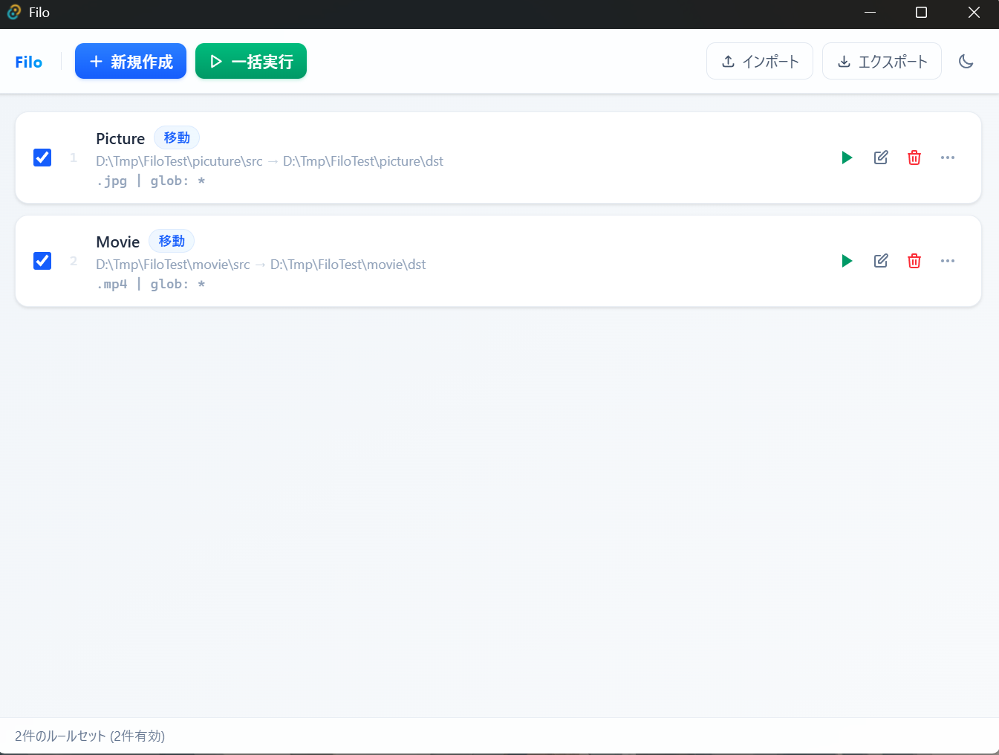

# Filo

> **ユーザー定義のルールセットで、ファイル整理を自動化する Windows 11 向け GUI アプリ**
>
> *A Windows 11 GUI app that automates file organization based on user-defined rulesets.*

[](https://github.com/eddybean/Filo/releases)
[](https://github.com/eddybean/Filo/releases)

---

## デモ



---

## 概要

Filo は、**ルールセット**（移動条件の定義）を登録しておくだけで、対象フォルダのファイルを自動で移動・コピーできるアプリです。

- ダウンロードフォルダに溜まったファイルを拡張子・日付・ファイル名パターンで分類したい
- 毎回手作業でやっている繰り返しのファイル整理を自動化したい
- 誤移動が怖いので Undo（元に戻す）できる仕組みが欲しい

といった場面で活躍します。

### 主要機能

- **ルールセット管理** — 作成・編集・削除・複製・ドラッグ&ドロップで並び替え
- **多彩なフィルタ条件** — 拡張子 / ファイル名（glob・正規表現）/ 作成日時・更新日時（複数条件は AND 結合）
- **移動 / コピー** を選択可能。同名ファイルの上書き制御も可
- **動的な保存先** — 正規表現の名前付きキャプチャグループを保存先パスに反映（`{変数名}` テンプレート）
- **Undo 機能** — 移動操作を個別または一括で元に戻せる
- **正規表現テスター** — パターンをリアルタイムで検証（サンプル入力 / ソースフォルダの実ファイルで確認）
- **インポート / エクスポート** — YAML ファイルでルールセットを共有・バックアップ
- **ライト / ダークモード** 対応（設定を永続化）
- **日本語 / 英語** 対応（OS 言語を自動検出）

---

## 使い方の例

### 例 1: スクリーンショットを月別フォルダに整理

ダウンロードフォルダに貯まった `.png` ファイルを、作成日ごとのフォルダへ移動する。

```yaml
name: スクリーンショット整理
source_dir: C:/Users/user/Downloads
destination_dir: C:/Users/user/Pictures/Screenshots
action: move
filters:
  extensions:
    - .png
  filename:
    pattern: "screenshot_*"
    match_type: glob
```

`screenshot_001.png` → `Pictures/Screenshots/screenshot_001.png` に移動される。

---

### 例 2: 正規表現で動的フォルダ振り分け

`99999_txt_123456.zip` のようなファイルを `D:/sorted/99999/123456/` へ自動振り分け。

```yaml
name: 文庫本
source_dir: D:/downloads
destination_dir: "D:/sorted/{label}/{id}"
action: move
filters:
  filename:
    pattern: '^(?P<label>\d+)_txt_(?P<id>\d+).+'
    match_type: regex
```

正規表現の **名前付きキャプチャグループ**（`label`・`id`）が保存先パスのテンプレート変数に自動展開される。

---

### 例 3: 古いログファイルをアーカイブドライブへ移動

昨年以前に更新された `.log` ファイルだけをアーカイブ先に移す。

```yaml
name: ログファイルアーカイブ
source_dir: C:/logs
destination_dir: D:/log_archive
action: move
overwrite: true
filters:
  extensions:
    - .log
  modified_at:
    end: "2024-12-31T23:59:59"
```

---

## インストール

### システム要件

- **OS**: Windows 11
- **追加ランタイム不要**（Tauri によるネイティブバイナリ）

### ダウンロード

[**GitHub Releases**](https://github.com/eddybean/Filo/releases) から最新の `.exe` インストーラをダウンロードしてください。

1. [Releases ページ](https://github.com/eddybean/Filo/releases) を開く
2. 最新リリースの `Filo_x.x.x_x64-setup.exe` をダウンロード
3. ダウンロードしたインストーラを実行

> **注**: Windows SmartScreen の警告が出た場合は「詳細情報」→「実行」でインストールできます。

---

## 開発環境構築

### 前提条件

- **Windows 11**
- **PowerShell 7**（[winget でインストール](https://learn.microsoft.com/ja-jp/powershell/scripting/install/installing-powershell-on-windows): `winget install Microsoft.PowerShell`）

### セットアップ

```bat
scripts\setup.bat
```

`setup.bat` を実行すると、[mise](https://mise.jdx.dev/) による Node.js / Rust のインストールから `npm install` まで自動で行われます。

### 開発サーバ起動

```bash
npm run tauri dev
```

---

## このプロジェクトについて

Filo は **[Claude Code](https://claude.ai/claude-code)** と **Anthropic の最新モデル Claude Sonnet 4.6** を活用して開発されました。

### AI 駆動開発の実践的な取り組み

このリポジトリでは、Claude Code を使った実践的な AI 協調開発の設定が作り込まれています：

| ファイル / 設定 | 内容 |
|---|---|
| [`CLAUDE.md`](CLAUDE.md) | Claude への開発ガイドライン（TDD の原則・テスト実行義務・コマンド規約など）|
| `.claude/` ディレクトリ | ワークツリー管理・セッション引き継ぎノート・起動設定 |
| `mise.toml` | Node.js・Rust のバージョンをコードで固定（再現可能な環境） |
| テスト強制 | コード変更後は必ず `vitest run` + `cargo test` を実行するルールを明示 |

Claude Code の `CLAUDE.md` を活用することで、AI エージェントがプロジェクトの規約・テスト方針・ツールチェーンを理解した状態で開発を進められます。

---

## ライセンス

MIT
